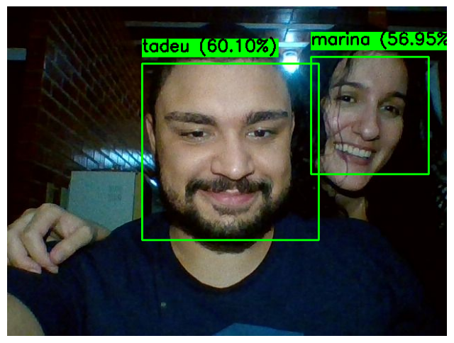

# Reconhecimento Facial

Este projeto realiza o reconhecimento facial utilizando a biblioteca **OpenCV** e outras ferramentas de aprendizado de máquina.

## 📸 Resultado Final

A imagem abaixo representa o resultado final do reconhecimento facial processado pelo código:



## 🛠 Tecnologias Utilizadas

- **Python** 🐍
- **OpenCV** (para manipulação de imagens)
- **dlib** (para detecção facial)
- **face_recognition** (biblioteca para reconhecimento facial)
- **NumPy** (manipulação de arrays e cálculos matemáticos)

## 🚀 Funcionalidades do Código

1. **Carregamento de Imagens:** O código carrega imagens contendo rostos para análise.
2. **Detecção Facial:** Utiliza um modelo pré-treinado para detectar rostos em imagens.
3. **Codificação Facial:** Converte os rostos detectados em vetores de características.
4. **Comparação de Faces:** Verifica a similaridade entre diferentes rostos e determina se eles pertencem à mesma pessoa.
5. **Marcação na Imagem:** Desenha retângulos e adiciona nomes às faces reconhecidas.
6. **Exibição do Resultado:** Mostra a imagem final processada.

## 📂 Como Usar

1. **Instale as dependências** usando o comando:
   ```bash
   pip install opencv-python dlib face_recognition numpy
   ```
2. **Execute o script Python**:
   ```bash
   python reconhecimento_facial.py
   ```
3. **Verifique a saída** com a imagem processada contendo os rostos identificados.

## 📝 Observações

- Certifique-se de que a imagem utilizada contém rostos bem visíveis.
- Se precisar ajustar a precisão do reconhecimento, pode ser necessário modificar os parâmetros do código.

---

✍️ Desenvolvido por Tadeu Augusto
