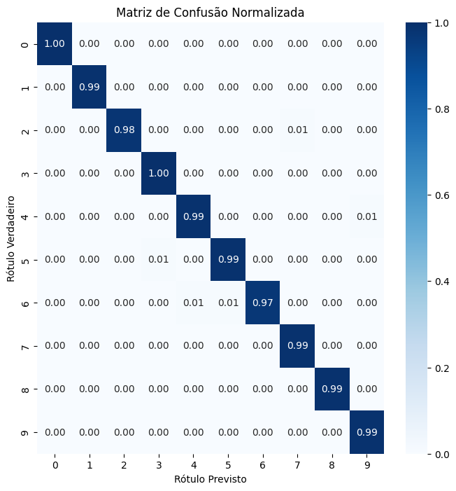

# 📊 Projeto DIO - Construção e Interpretação de Matriz de Confusão

Este projeto apresenta a implementação de uma **Matriz de Confusão** utilizando Python, com o objetivo de avaliar o desempenho de modelos de classificação.

---

## 📌 Objetivo

Demonstrar como construir e interpretar uma matriz de confusão em Python, utilizando bibliotecas como `scikit-learn` e `matplotlib`, para avaliar a performance de modelos de classificação.

---

## 🚀 Tecnologias Utilizadas

- Python
- Scikit-learn
- Matplotlib
- Seaborn

---

## 🧪 Metodologia

1. **Importação das Bibliotecas Necessárias**:
   - `pandas` para manipulação de dados.
   - `numpy` para operações numéricas.
   - `seaborn` e `matplotlib.pyplot` para visualização de dados.
   - `train_test_split` do `sklearn.model_selection` para dividir os dados em conjuntos de treino e teste.
   - `LogisticRegression` do `sklearn.linear_model` como modelo de classificação.
   - `classification_report` e `confusion_matrix` do `sklearn.metrics` para avaliação do modelo.

2. **Carregamento e Preparação dos Dados**:
   - Carregamento do conjunto de dados.
   - Pré-processamento e transformação de variáveis categóricas em variáveis dummy.

3. **Divisão dos Dados**:
   - Separação das variáveis independentes (features) e da variável dependente (target).
   - Divisão dos dados em conjuntos de treino e teste.

4. **Construção e Treinamento do Modelo**:
   - Instanciação e treinamento de um modelo de Regressão Logística com os dados de treino.

5. **Avaliação do Modelo**:
   - Geração de previsões com os dados de teste.
   - Construção da matriz de confusão para avaliar o desempenho do modelo.
   - Cálculo das métricas de precisão, recall e f1-score utilizando o `classification_report`.

---

## 📊 Resultados

- **Matriz de Confusão**:
  - A matriz de confusão gerada permite visualizar o desempenho do modelo em termos de verdadeiros positivos, falsos positivos, verdadeiros negativos e falsos negativos.
  - Matriz de confusão gerada:



- **Métricas de Avaliação**:
  - As métricas de precisão, recall e f1-score fornecem uma compreensão detalhada sobre a performance do modelo em cada classe.

---

## 📂 Organização dos Arquivos

- `matriz_confusao.ipynb`: Notebook Jupyter contendo todo o pipeline do projeto, desde a importação dos dados até a avaliação do modelo.

---

## 📌 Como Executar o Projeto

1. Clone este repositório:
   ```bash
   git clone https://github.com/tadeuaugustovs/ML_DIO.git
   cd ML_DIO/matriz_de_confusao
